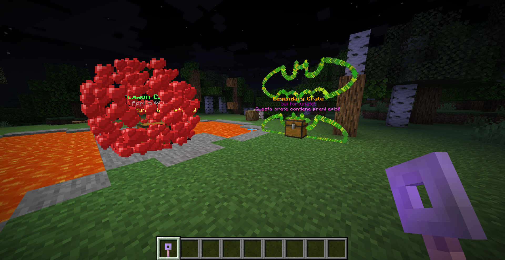
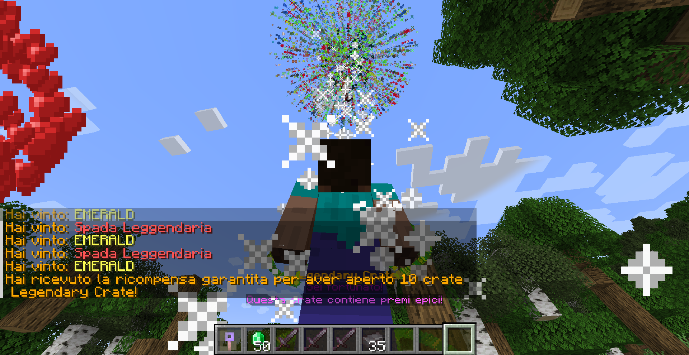
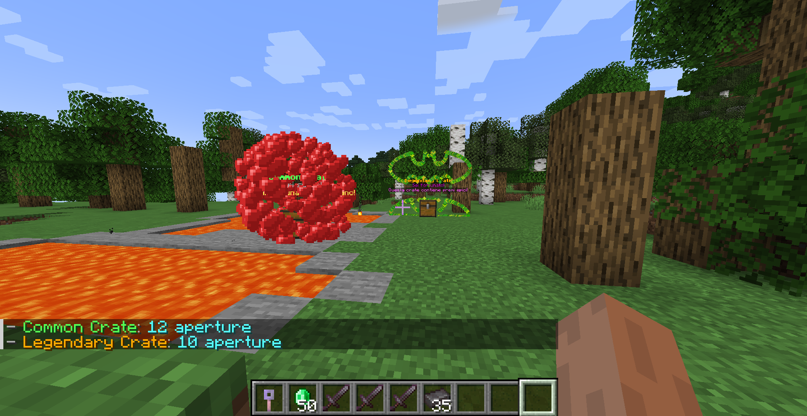

<p align="center">
  
  
  
  <a href="https://github.com/MonkeyMoon104/UltimateCrates/releases/latest">
    
  </a>
  <a href="https://github.com/MonkeyMoon104/UltimateCrates/stargazers">
    
  </a>
</p>

<h1 align="center">UltimateCrates</h1>
<p align="center"><b>A powerful, animated and fully customizable crates plugin for Paper 1.21+</b></p>

---

## ✨ Main Features

* 🔑 **Physical & Virtual Keys**
* 📦 **Multiple Crate Types** with full customization
* 🎆 **Advanced Visual Effects & Animations**
* 📊 **Statistics & Top Players System**
* 🔌 **Official Developer API** to manage stats and leaderboards
* 🧠 **PlaceholderAPI Support** for integration in scoreboards, tabs, etc.
* 💰 **Vault Integration** for economy and key purchasing
* 🧼 **MySQL or SQLite Database Support**
* ♻️ **Reload Command** – no need to restart your server!

---

## 🌐 Language

* 🇮🇹 The default language is **Italian**
* ✍️ All texts can be translated by editing the `messages.yml` and `crates.yml` files
* 🧩 Full Unicode & color code support for multilingual servers

---

## ⚙️ Requirements

Make sure these dependencies are installed:

- [NBTAPI](https://www.spigotmc.org/resources/nbt-api.7939/)
- [PlayerParticles](https://www.spigotmc.org/resources/playerparticles.40261/)
- [PlaceholderAPI](https://www.spigotmc.org/resources/placeholderapi.6245/)
- [LuckPerms](https://luckperms.net/)
- [Vault](https://www.spigotmc.org/resources/vault.34315/)

---

## 🧩 Configuration

### `config.yml`

```yaml
db_central:
  type: "sqlite"   # sqlite or mysql
  host: "localhost"
  port: 3306
  database: "ultimatecrates"
  username: "root"
  password: "password"
````

### `crates.yml`

Each crate includes:

* Name, key type, customizable rewards
* Particles and animations (e.g. spiral, fireworks)
* Guaranteed reward after X openings (`reward.every`)
* Optional key purchasing support

Example:

```yaml
crates:
  common:
    name: "&aCommon Crate"
    keys:
      type: physic
      name: "&aCommon Crate Key"
      enchanted: true
      canbuy:
        enabled: true
        cost: 100.0
```

---

## 🔧 Commands

| Command                                    | Description                   |
| ------------------------------------------ | ----------------------------- |
| `/crate`                                   | Main command                  |
| `/crate help`                              | Shows help                    |
| `/crate give <crate> <player>`             | Give a crate to a player      |
| `/crate givekey <crate> [player] [amount]` | Give physical or virtual keys |
| `/crate stats`                             | View or reset statistics      |
| `/crate virtualkeys`                       | Manage virtual keys           |
| `/crate top <crate>`                       | Show crate leaderboard        |
| `/crate buykey <crate> [amount]`           | Buy keys with Vault           |
| `/crate reload`                            | Reload plugin without restart |

---

## 🔐 Permissions

### Admin

* `uc.admin` – All administrative permissions

  * `uc.admin.give`
  * `uc.admin.givekey`
  * `uc.admin.reload`
  * `uc.admin.stats.reset`
  * `uc.admin.vkeys.reset`
  * `uc.admin.break`
  * `uc.admin.crate.place`

### User

* `uc.user` – All basic player permissions

  * `uc.help.use`
  * `uc.stats.use`
  * `uc.vkeys.use`
  * `uc.crate.open`
  * `uc.preview.see`
  * `uc.top.use`
  * `uc.buykey.use`

---

## 📢 API Interface!

UltimateCrates now includes an official API interface for developers!

[](https://github.com/MonkeyMoon104/UCApi)

---

## 🔌 Developer API

UltimateCrates provides a clean and easy-to-use **developer API** via the `UltimateCratesProvider` interface.

### 🌎 JitPack Helper
[](https://jitpack.io/#MonkeyMoon104/UCApi)


### 📦 Maven Dependency

```xml
<repository>
  <id>jitpack.io</id>
  <url>https://jitpack.io</url>
</repository>

<dependency>
  <groupId>com.github.MonkeyMoon104</groupId>
  <artifactId>UCApi</artifactId>
  <version>TAG</version>
</dependency>
```

### 🧩 Accessing the API

```java
import com.monkey.ultimatecrates.api.UltimateCratesAPI;
import com.monkey.ultimatecrates.api.UltimateCratesProvider;

UltimateCratesProvider api = UltimateCratesAPI.get();
```

### 🛠️ Available Methods

```java
public interface UltimateCratesProvider {

    void incrementCrateOpen(String playerName, String crateId);

    int getCrateOpens(String playerName, String crateId);

    List<LeaderboardEntry> getLeaderboard(String crateId, int page, int rowPerPage);

    void resetPlayerStats(String playerName);

    void resetAllStats();
}
```

### 🔍 API Status

```java
boolean available = UltimateCratesAPI.isRegistered();
```

### 📝 Registering the API (internal use only)

```java
public class MainPlugin extends JavaPlugin {
  public void onEnable() {
    UltimateCratesAPI.register(newProvider, getLogger());
  }
}
```

> ⚠️ The `register` method can only be called once. If it's called again, it will be ignored with a warning.

---

## 💬 Customizable Messages

All messages are editable from `messages.yml`. Supports color codes and dynamic placeholders like `%crate%`, `%amount%`, `%player%`, etc.

Example:

```yaml
command:
  unknown_command: "&cUnknown command. Use /crate help"
give:
  give_success: "&aYou gave crate '%crate%&a' to &b%player%."
```

---

## 🔮 Supported Effects & Animations

| Particle Effects   | Animations                |
| ------------------ | ------------------------- |
| heart, totem, etc. | spiral, fireworks, batman |

---

## 🏆 Stats & Leaderboards

Includes a powerful tracking system:

* Tracks openings per player & crate
* Global leaderboard per crate (`/crate top`)
* Guaranteed reward after X openings (e.g. every 5, 10...)

---

## 📸 Small Preview Example

> 
> 
> 


---

## 🧪 Compatibility

* ✅ Fully tested on **Paper 1.21+**

---

## 👨‍💻 Author

**Made with ❤️ by MonkeyMoon104**

> Have ideas, suggestions or bugs to report?<br>
> [Open an issue](https://github.com/MonkeyMoon104/UltimateCrates/issues) or reach me on Discord!

---

## 🌟 Support the Project

<p align="center">
  <a href="https://github.com/MonkeyMoon104/UltimateCrates" target="_blank">
    
  </a>
  <a href="https://github.com/MonkeyMoon104/UltimateCrates/issues" target="_blank">
    
  </a>
</p>

<p align="center">
  <b>If you enjoy using UltimateCrates, please support it by leaving a ⭐ on GitHub.</b><br>
  ❤️‍🔥

</p>


---